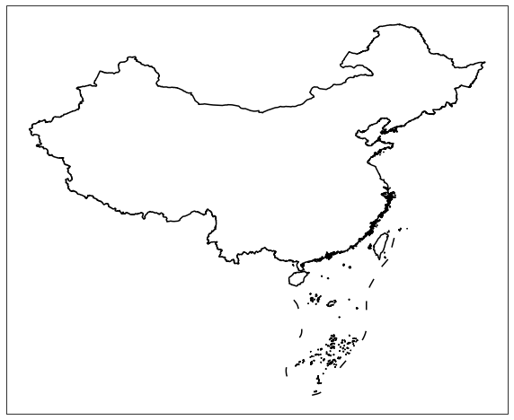
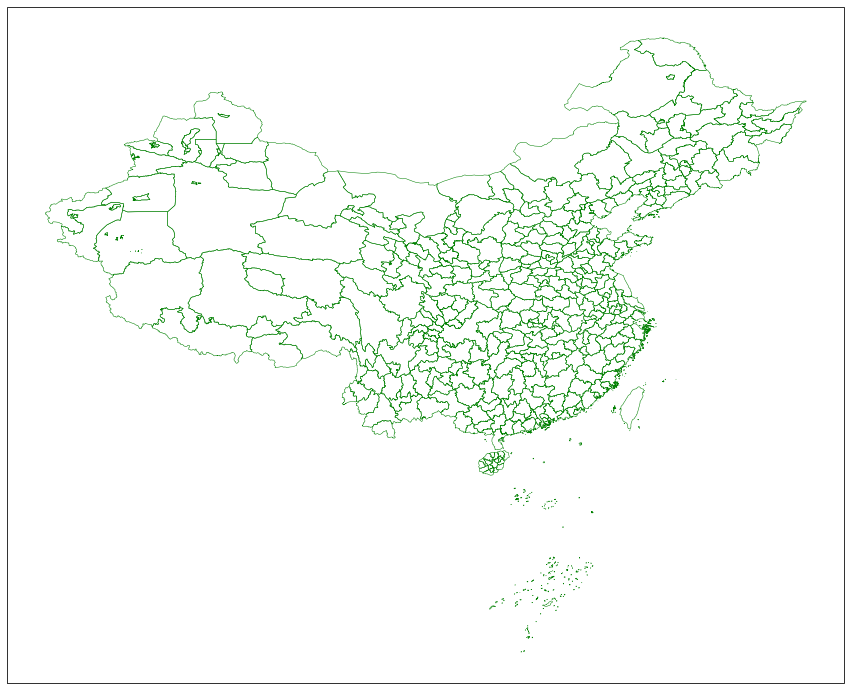
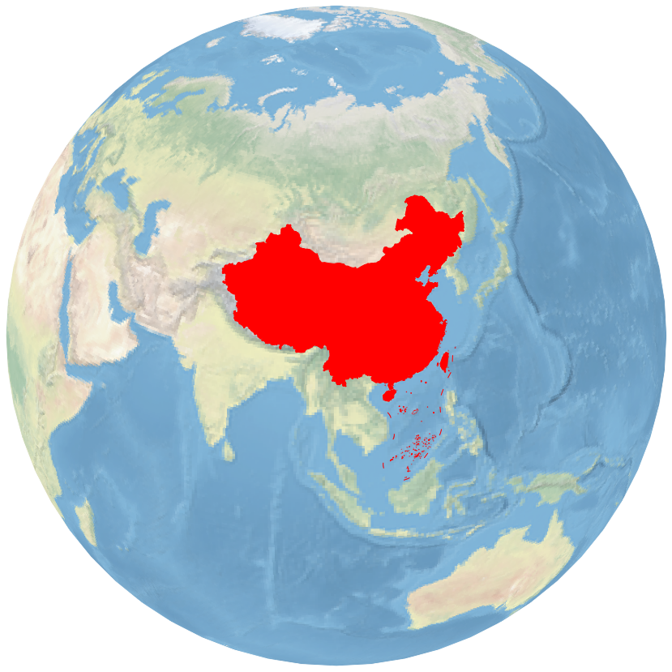

<h1 align="center" style="margin:1em;">
  <a href="static/images/logo.png">
    </a>
</h1>

<p align="center">

<a href="https://github.com/cnmetlab/cnmaps/actions/workflows/python-package-conda.yml">
</a>

<a href="https://github.com/cnmetlab/cnmaps/actions/workflows/pypi-publish.yml">
 </a>

<a href="https://anaconda.org/conda-forge/cnmaps">
</a>

<a href="https://anaconda.org/conda-forge/cnmaps">
 </a>

<a href="https://anaconda.org/conda-forge/cnmaps">
 </a>

<a href="https://anaconda.org/conda-forge/cnmaps">
 </a>

<a href="https://badge.fury.io/py/cnmaps">
</a>

<a href="https://pepy.tech/project/cnmaps">
</a>
  
<a href='https://cnmaps.readthedocs.io/zh_CN/latest/'>
    
</a>
  
<a href="https://www.codacy.com/gh/Clarmy/cnmaps/dashboard?utm_source=github.com&amp;utm_medium=referral&amp;utm_content=Clarmy/cnmaps&amp;utm_campaign=Badge_Grade">
  
 </a>
 
<a href="https://cnmetlab.github.io/cnmaps/performance/">
  
 </a>

<a href="https://codecov.io/gh/cnmetlab/cnmaps" > 
  
 </a>

<a href="https://github.com/Clarmy/cnmaps/issues">
</a>

<a href="https://github.com/psf/black">
</a>
</p>

<h4 align="center">
    cnmaps是一个可以让中国地图画起来更丝滑的地图类python扩展包
</h4>

## 安装
安装cnmaps建议使用Python的解释器在3.8版本及以上。

### 使用conda安装
cnmaps最简单的安装方法是使用conda安装： ``$ conda install -c conda-forge cnmaps``

### 使用pip安装
若要使用pip安装，则需要手动安装一些依赖：

* cartopy: `$ conda install -c conda-forge "cartopy>=0.20.0"`
* fiona: `$ conda install -c conda-forge "fiona>=1.8.21"`

在完成上述依赖的安装以后，你可以使用pip来安装cnmaps： `$ pip install -U cnmaps`


## 快速开始

### 绘制国界

用最简单直接的方式，来绘制你的第一张中国地图。   

```python
import cartopy.crs as ccrs
import matplotlib.pyplot as plt
from cnmaps import get_adm_maps, draw_maps

fig = plt.figure(figsize=(10,10))
ax = fig.add_subplot(111, projection=ccrs.PlateCarree())

draw_maps(get_adm_maps(level='国')) 
plt.show()
```



### 绘制省界

cnmaps还可以绘制各省（特区/直辖市）的地图

```python
import cartopy.crs as ccrs
import matplotlib.pyplot as plt
from cnmaps import get_adm_maps, draw_maps

fig = plt.figure(figsize=(10,10))
ax = fig.add_subplot(111, projection=ccrs.PlateCarree())

draw_maps(get_adm_maps(level='省'), linewidth=0.8, color='r') 

plt.show()
```


### 绘制市界

cnmaps可以绘制市级的行政区地图。

```python
import cartopy.crs as ccrs
import matplotlib.pyplot as plt
from cnmaps import get_adm_maps, draw_maps

fig = plt.figure(figsize=(15,15))
ax = fig.add_subplot(111, projection=ccrs.PlateCarree())

draw_maps(get_adm_maps(level='市'), linewidth=0.5, color='g') 

plt.show()
```


### 绘制区县界

cnmaps可以绘制区县级的行政区地图。

```python
import cartopy.crs as ccrs
import matplotlib.pyplot as plt
from cnmaps import get_adm_maps, draw_maps

fig = plt.figure(figsize=(20,20))
ax = fig.add_subplot(111, projection=ccrs.PlateCarree())

draw_maps(get_adm_maps(level='区县'), linewidth=0.8, color='r') 

plt.show()
```


### Logo

本项目的Logo地图是如何绘制的？请执行下面的代码。

```python
import cartopy.crs as ccrs
import matplotlib.pyplot as plt
from cnmaps import get_adm_maps

fig = plt.figure(figsize=(5,5))
proj = ccrs.Orthographic(central_longitude=100.0, central_latitude=30)
ax = fig.add_subplot(111, projection=proj)

ax.stock_img()
china, sourth_sea = get_adm_maps(level='国', only_polygon=True)

ax.set_global()
ax.add_geometries(china, crs=ccrs.PlateCarree(), edgecolor='r', facecolor='r')
ax.add_geometries(sourth_sea, crs=ccrs.PlateCarree(), edgecolor='r')
ax.outline_patch.set_edgecolor('white')

plt.savefig('../static/images/logo-base.png', bbox_inches='tight')
```



## 使用指南

针对本项目更多的使用方法，我们还有一份更详细的文档：[cnmaps使用指南](https://cnmaps.readthedocs.io/zh_CN/latest/index.html)

## 引用

本项目适用的地图边界的数据源包括：

1. GaryBikini/ChinaAdminDivisonSHP: v2.0, 2021, DOI: 10.5281/zenodo.4167299

海拔高度地形数据来自ASTER数字高程模型，并对原始数据进行了稀释。
