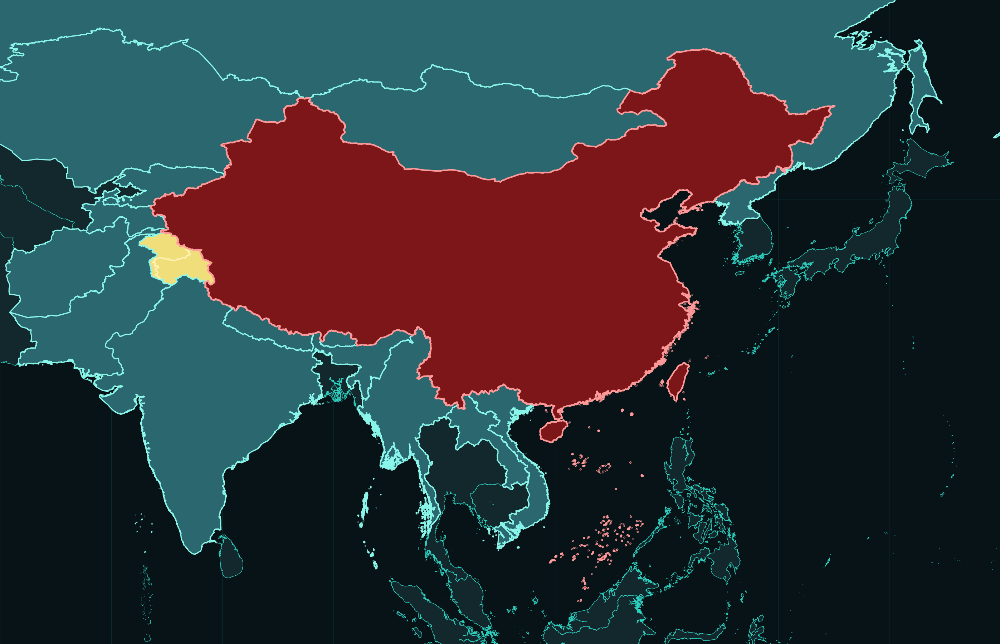
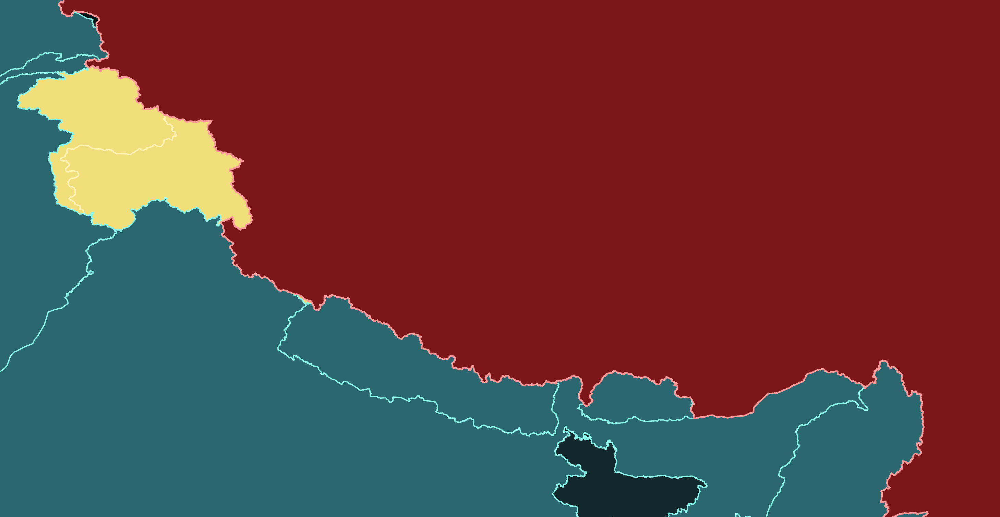

############
数据源说明
############

`cnmaps <https://github.com/cnmetlab/cnmaps>`_ 自身主要提供查询、绘图、裁剪和处理能力；从 ``2.0.0`` 开始，官方边界与样例数据已经拆分到独立包 `cnmaps-data <https://github.com/cnmetlab/cnmaps-data>`_ 中。

当前官方数据包中，主要有两类与边界相关的数据来源：

1. 中国行政区边界

   - 原始数据来自 **高德（Amap）**
   - 独立对照与学术引用可使用 `GaryBikini/ChinaAdminDivisonSHP v2.0 <https://github.com/GaryBikini/ChinaAdminDivisonSHP>`_ （2021），Zenodo DOI `10.5281/zenodo.4167299 <https://doi.org/10.5281/zenodo.4167299>`_
   - 在 `cnmaps-data` 中统一作为中国省 / 市 / 区县边界使用
   - 对外查询时，索引中的 ``source`` 为 ``高德``

2. 国外国家与地区边界

   - 原始数据来自 `World Bank Official Boundaries - Admin 0 <https://datacatalog.worldbank.org/search/dataset/0038272/world-bank-official-boundaries>`_
   - 在 `cnmaps-data` 中统一作为中国及港澳台地区以外的国家 / 地区级边界使用
   - 对外查询时，索引中的 ``source`` 为 ``世界银行``

在这些原始数据之上，官方数据包还做了若干与 ``cnmaps`` 使用体验直接相关的处理：

- 对中国边界与国外边界做了统一整理，使其能在同一套查询接口中使用
- 对中国周边国家与地区做了基于中国边界口径的几何扣除与衔接处理
- 对部分争议地区做了单独分类或保留
- 为国外国家 / 地区补充 ``ISO3`` 或组合码，便于国家级查询
- 为中国行政区统一补充 ``longitude`` / ``latitude`` 等可用于标注的中心点信息

如果你需要更完整的数据协议、目录结构和来源说明，可以继续阅读：

- `cnmaps-data README <https://github.com/cnmetlab/cnmaps-data/blob/main/README.md>`_
- `cnmaps-data 开发者手册 <https://github.com/cnmetlab/cnmaps-data/blob/main/docs/developer-guide.md>`_

边界处理效果
--------------

下面几张图用于展示当前官方数据包对中国周边边界、争议区以及海上方向的处理效果：

- 中国使用暗红色表示
- 周边国家与地区使用蓝绿色表示
- 单独保留的争议地区使用浅黄色表示

总览
^^^^

中印边界与克什米尔争议区
^^^^^^^^^^^^^^^^^^^^^^^^^^

南海方向
^^^^^^^^

.. image:: ../_static/south-china-sea.png
   :width: 92%
   :align: center

中国-塔吉克斯坦边界
^^^^^^^^^^^^^^^^^^^^

.. image:: ../_static/china-tajikistan-border.png
   :width: 92%
   :align: center

关于中国和塔吉克斯坦之间出现的空隙，需要额外说明：

- 中国和塔吉克斯坦之间长期存在未定国界问题。
- 世界银行及其他国际版本边界数据在中塔边界处采用的口径，与中国大陆正规地图的未定国界口径并不一致。
- 中国大陆当前主流正规地图在这一段边界上的口径，相比国际版本更小；这和其他“自己主张更大范围”的争议区不同，属于“当前中国大陆公开审图口径反而更吃亏”的情况。
- 天地图、高德、百度等带审图号的主流地图产品，目前在这里普遍都采用这一更小的版本。
- 因此，当中国边界与世界银行的外国边界在中塔边境直接拼接时，会留下图中可见的一片空白区域。
- 基于最小改动原则，当前官方数据包对这一处仅做说明，不做额外人工填补或再分配处理。
