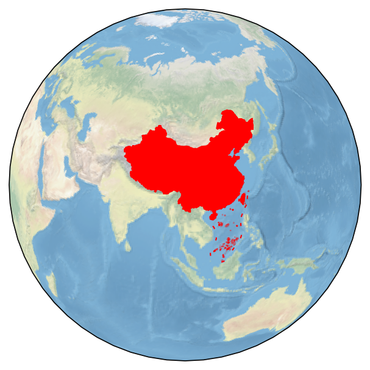
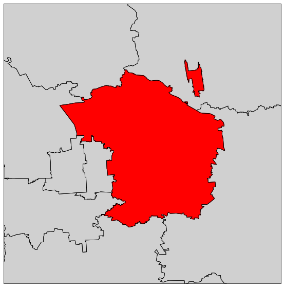
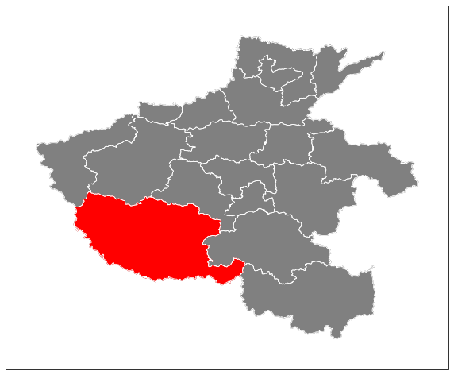

综合示例
============

绘制项目LOGO底图
-------------------

.. code:: python

    import cartopy.crs as ccrs
    import matplotlib.pyplot as plt
    from cnmaps import get_adm_maps

    fig = plt.figure(figsize=(5,5))
    proj = ccrs.Orthographic(central_longitude=100.0, central_latitude=30)
    ax = fig.add_subplot(111, projection=proj)

    ax.stock_img()
    china, sourth_sea = get_adm_maps(level='国', only_polygon=True)

    ax.set_global()
    ax.add_geometries(china, crs=ccrs.PlateCarree(), edgecolor='r', facecolor='r')
    ax.add_geometries(sourth_sea, crs=ccrs.PlateCarree(), edgecolor='r')
    ax.outline_patch.set_edgecolor('white')

    plt.show()

绘制北京市朝阳区行政图
------------------------

.. code:: python

    import cartopy.crs as ccrs
    import matplotlib.pyplot as plt
    from cnmaps import get_adm_maps, draw_maps

    fig = plt.figure(figsize=(10,10))
    ax = fig.add_subplot(111, projection=ccrs.PlateCarree())

    beijing = get_adm_maps(city='北京市', record='first', only_polygon=True)
    chaoyang = get_adm_maps(district='朝阳区', level='区县', record='first', only_polygon=True)

    ax.add_geometries(beijing, crs=ccrs.PlateCarree(), edgecolor='#D0D0D0', facecolor='#D0D0D0')
    draw_maps(get_adm_maps(city='北京市', level='区县'), color='k', linewidth=0.8)
    ax.add_geometries(chaoyang, crs=ccrs.PlateCarree(), edgecolor='r', facecolor='r')
    ax.set_extent(chaoyang.get_extent(buffer=0.1))

    plt.show()

绘制河南省行政图
-------------------------
河南省行政图，南阳市高亮

.. code:: python

    import cartopy.crs as ccrs
    import matplotlib.pyplot as plt
    from cnmaps import get_adm_maps, draw_maps

    fig = plt.figure(figsize=(10,10))
    ax = fig.add_subplot(111, projection=ccrs.PlateCarree())

    province = get_adm_maps(province='河南省', record='first', only_polygon=True)
    city = get_adm_maps(city='南阳市', record='first', only_polygon=True)
    ax.add_geometries(province, crs=ccrs.PlateCarree(), edgecolor='grey', facecolor='grey')
    ax.add_geometries(city, crs=ccrs.PlateCarree(), edgecolor='r', facecolor='r')
    draw_maps(get_adm_maps(province='河南省', level='市'), color='w', linewidth=0.8)
    ax.set_extent(province.get_extent(buffer=0.5))

    plt.show()

