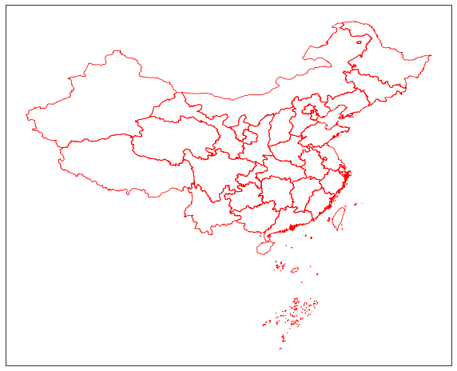
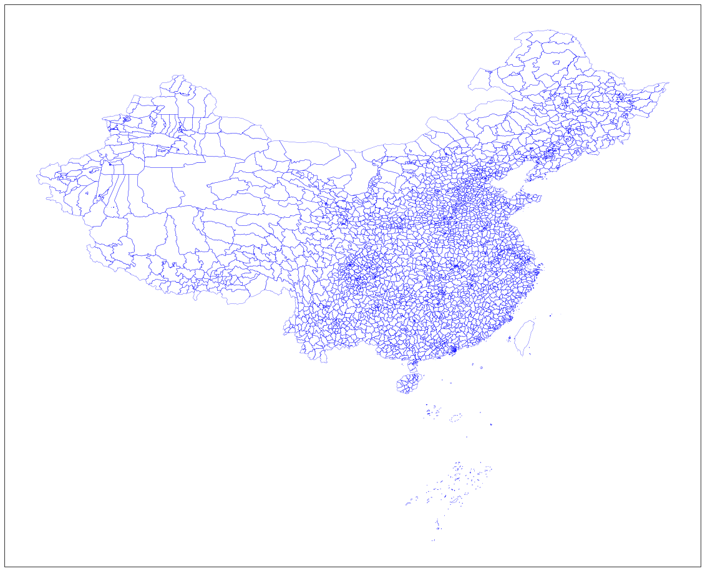
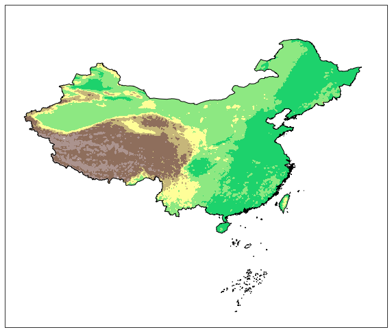
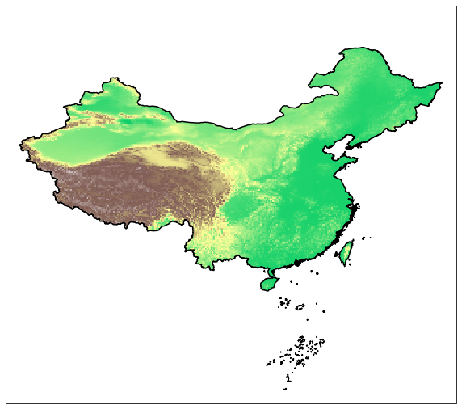
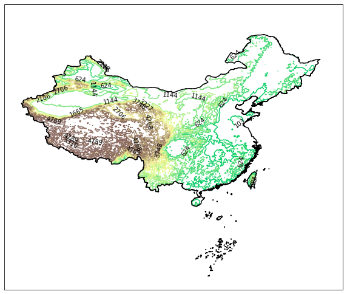

快速开始
===========
我们先用几个小例子，快速入门cnmaps的基本功能的使用。

查询行政边界
------------
你可以使用 ``get_adm_maps`` 轻松查询到你想要的行政边界，例如你想要查询北京市，可以使用以下方式。

.. code:: python

    In [1]: from cnmaps import get_adm_maps

    In [2]: get_adm_maps(city='北京市')
    Out[2]:
    [{'国家': '中华人民共和国',
    '省/直辖市': '北京市',
    '市': '北京市',
    '区/县': None,
    '级别': '市',
    '来源': '高德',
    '类型': '陆地',
    'geometry': <cnmaps.maps.MapPolygon at 0x7f861690c050>}]

查询海淀区。

.. code:: python

    In [1]: from cnmaps import get_adm_maps

    In [2]: get_adm_maps(district='海淀区')
    Out[2]:
    [{'国家': '中华人民共和国',
    '省/直辖市': '北京市',
    '市': '北京市',
    '区/县': '海淀区',
    '级别': '区县',
    '来源': '高德',
    '类型': '陆地',
    'geometry': <cnmaps.maps.MapPolygon at 0x7f861af85fd0>}]

查询山西省。

.. code:: python

    In [1]: from cnmaps import get_adm_maps

    In [2]: get_adm_maps(province='山西省')
    Out[2]:
    [{'国家': '中华人民共和国',
    '省/直辖市': '山西省',
    '市': None,
    '区/县': None,
    '级别': '省',
    '来源': '高德',
    '类型': '陆地',
    'geometry': <cnmaps.maps.MapPolygon at 0x7f8618f86790>}]

查询山西省下辖地级市。

.. code:: python

    In [1]: from cnmaps import get_adm_maps

    In [2]: get_adm_maps(province='山西省', level='市')
    Out[2]:
    [{'国家': '中华人民共和国',
    '省/直辖市': '山西省',
    '市': '太原市',
    '区/县': None,
    '级别': '市',
    '来源': '高德',
    '类型': '陆地',
    'geometry': <cnmaps.maps.MapPolygon at 0x7f863fd618d0>},
    ... # 为节省篇幅，中间部分省略
    '省/直辖市': '山西省',
    '市': '吕梁市',
    '区/县': None,
    '级别': '市',
    '来源': '高德',
    '类型': '陆地',
    'geometry': <cnmaps.maps.MapPolygon at 0x7f863fd613d0>}]

    In [3]: get_adm_maps(province='山西省', level='市', engine='geopandas')
    Out[3]:
            国家 省/直辖市    市   区/县 级别  来源  类型                                           geometry
    0   中华人民共和国   山西省  太原市  None  市  高德  陆地  MULTIPOLYGON (((113.06683 38.05646, 113.06708 ...
    1   中华人民共和国   山西省  大同市  None  市  高德  陆地  MULTIPOLYGON (((113.57727 39.43812, 113.57460 ...
    2   中华人民共和国   山西省  阳泉市  None  市  高德  陆地  MULTIPOLYGON (((113.99691 37.70448, 113.99567 ...
    3   中华人民共和国   山西省  长治市  None  市  高德  陆地  MULTIPOLYGON (((111.99642 36.68713, 111.99480 ...
    4   中华人民共和国   山西省  晋城市  None  市  高德  陆地  MULTIPOLYGON (((113.46543 35.51493, 113.46300 ...
    5   中华人民共和国   山西省  朔州市  None  市  高德  陆地  MULTIPOLYGON (((112.62431 40.23685, 112.62429 ...
    6   中华人民共和国   山西省  晋中市  None  市  高德  陆地  MULTIPOLYGON (((113.06683 38.05646, 113.06903 ...
    7   中华人民共和国   山西省  运城市  None  市  高德  陆地  MULTIPOLYGON (((110.90373 34.66882, 110.89349 ...
    8   中华人民共和国   山西省  忻州市  None  市  高德  陆地  MULTIPOLYGON (((111.26944 39.42373, 111.27091 ...
    9   中华人民共和国   山西省  临汾市  None  市  高德  陆地  MULTIPOLYGON (((110.41054 36.89947, 110.41487 ...
    10  中华人民共和国   山西省  吕梁市  None  市  高德  陆地  MULTIPOLYGON (((111.41469 36.80403, 111.41071 ...

.. note:: 当你向 ``get_adm_maps`` 传递行政区域的名称时，应传入行政区的正式全称，简称无法识别，如果不知道全称可以通过 ``get_adm_names`` 查询。

假如我们不知道省一级行政区的正式名称，可以执行：

.. code:: python

    In [1]: from cnmaps import get_adm_names

    In [2]: get_adm_names(level='省')
    Out[2]:
    ['北京市',
    '天津市',
    '河北省',
    ... # 为节省篇幅，中间部分省略
    '台湾省',
    '香港特别行政区',
    '澳门特别行政区']

当我们已经知道了省的名称以后，可以继续下探到市，以四川省为例：

.. code:: python

    In [1]: from cnmaps import get_adm_names

    In [2]: get_adm_names(province='四川省', level='市')
    Out[2]:
    ['成都市',
    '自贡市',
    '攀枝花市',
    ... # 为节省篇幅，中间部分省略
    '阿坝藏族羌族自治州',
    '甘孜藏族自治州',
    '凉山彝族自治州']

知道了市的名称以后，可以继续下探到区县，以成都市为例：

.. code:: python

    In [1]: from cnmaps import get_adm_names

    In [2]: get_adm_names(province='四川省', city='成都市', level='区县')
    Out[2]:
    ['锦江区',
    '青羊区',
    '金牛区',
    ... # 为节省篇幅，中间部分省略
    '邛崃市',
    '崇州市',
    '简阳市']

绘制行政边界
------------
前面使用 ``get_adm_maps`` 获取的行政边界地图列表，可以直接传入 ``draw_maps`` 函数进行绘图。

我们先来用最简单直接的方式，来绘制你的第一张中国国界地图。

.. code:: python
    
    import cartopy.crs as ccrs
    import matplotlib.pyplot as plt
    from cnmaps import get_adm_maps, draw_maps

    fig = plt.figure(figsize=(10,10))
    ax = fig.add_subplot(111, projection=ccrs.PlateCarree())

    draw_maps(get_adm_maps(level='国')) 

    plt.show()

.. image:: ../_static/country-level.png

我们再来绘制一张各省的行政边界地图。

.. code:: python

    import cartopy.crs as ccrs
    import matplotlib.pyplot as plt
    from cnmaps import get_adm_maps, draw_maps

    fig = plt.figure(figsize=(10,10))
    ax = fig.add_subplot(111, projection=ccrs.PlateCarree())

    draw_maps(get_adm_maps(level='省'), linewidth=0.8, color='r') 

    plt.show()

然后是市级行政区。

.. code:: python

    import cartopy.crs as ccrs
    import matplotlib.pyplot as plt
    from cnmaps import get_adm_maps, draw_maps

    fig = plt.figure(figsize=(15,15))
    ax = fig.add_subplot(111, projection=ccrs.PlateCarree())

    draw_maps(get_adm_maps(level='市'), linewidth=0.5, color='g') 

    plt.show()

.. image:: ../_static/city-level.png

最后是区县。

.. code:: python

    import cartopy.crs as ccrs
    import matplotlib.pyplot as plt
    from cnmaps import get_adm_maps, draw_maps

    fig = plt.figure(figsize=(20,20))
    ax = fig.add_subplot(111, projection=ccrs.PlateCarree())

    draw_maps(get_adm_maps(level='区县'), linewidth=0.3, color='b') 

    plt.show()

合并边界
----------
cnmaps可以很方便地对地图进行合并，例如我们可以将北京、天津、河北的边界对象直接相加获得京津冀的边界对象并绘图。

.. code:: python

    import cartopy.crs as ccrs
    import matplotlib.pyplot as plt
    from cnmaps import get_adm_maps, draw_map

    beijing = get_adm_maps(province='北京市', only_polygon=True, record='first')
    tianjin = get_adm_maps(province='天津市', only_polygon=True, record='first')
    hebei = get_adm_maps(province='河北省', only_polygon=True, record='first')

    jingjinji = beijing + tianjin + hebei

    fig = plt.figure(figsize=(5,5))
    ax = fig.add_subplot(111, projection=ccrs.PlateCarree())
    draw_map(jingjinji)

    plt.show()

.. image:: ../_static/jingjinji.png

剪切地图
-----------

剪切填色等值线(contourf)图

.. code:: python

    from cnmaps import get_adm_maps, clip_contours_by_map, draw_map
    from cnmaps.sample import load_dem

    lons, lats, data = load_dem()

    fig = plt.figure(figsize=(10, 10))
    ax = fig.add_subplot(111, projection=ccrs.PlateCarree())
    map_polygon = get_adm_maps(country='中华人民共和国', record='first', only_polygon=True)

    cs = ax.contourf(lons, lats, data,
                    cmap=plt.cm.terrain,
                    levels=np.linspace(-2800, data.max(), 10),
                    transform=ccrs.PlateCarree())

    clip_contours_by_map(cs, map_polygon)
    draw_map(map_polygon, color='k', linewidth=1)

    plt.show()

剪切填色(pcolormesh)图

.. code:: python

    import cartopy.crs as ccrs
    import matplotlib.pyplot as plt
    from cnmaps import get_adm_maps, draw_map, clip_pcolormesh_by_map
    from cnmaps.sample import load_dem

    lons, lats, dem = load_dem()
    fig = plt.figure(figsize=(10, 10))

    map_polygon = get_adm_maps(country='中华人民共和国', record='first', only_polygon=True)

    ax = fig.add_subplot(111, projection=ccrs.PlateCarree())
    mesh = ax.pcolormesh(lons, lats, dem, cmap=plt.cm.terrain, vmin=-2800, transform=ccrs.PlateCarree())
    clip_pcolormesh_by_map(mesh, map_polygon)
    draw_map(map_polygon, color='k')
    ax.set_extent(map_polygon.get_extent())

    plt.show()

剪切等值线clabel

.. code:: python

    from cnmaps import get_adm_maps, clip_clabels_by_map, clip_contours_by_map, draw_map
    from cnmaps.sample import load_dem

    lons, lats, data = load_dem()

    map_polygon = get_adm_maps(
        country='中华人民共和国', record='first', only_polygon=True)
    fig = plt.figure(figsize=(10, 10))
    ax = fig.add_subplot(111, projection=ccrs.PlateCarree())
    contours = ax.contour(lons,
                            lats,
                            data,
                            cmap=plt.cm.terrain,
                            levels=np.linspace(-2500, data.max(), 20),
                            transform=ccrs.PlateCarree())
    clip_contours_by_map(contours, map_polygon)
    clabels = ax.clabel(contours,
                            levels=contours.levels,
                            colors='k',
                            fmt='%i',
                            inline=True)
    clip_clabels_by_map(clabels, map_polygon)
    draw_map(map_polygon, color='k')

多投影支持
-----------

.. code:: python

    import cartopy.crs as ccrs
    import matplotlib.pyplot as plt
    from cnmaps import get_adm_maps, draw_map, clip_contours_by_map
    from cnmaps.sample import load_dem

    lons, lats, dem = load_dem()

    PROJECTIONS = [
        ('Mercator', ccrs.Mercator(central_longitude=100)),
        ('Mollweide', ccrs.Mollweide(central_longitude=100)),
        ('Orthographic', ccrs.Orthographic(central_longitude=100)),
        ('Robinson', ccrs.Robinson(central_longitude=100))
    ]

    fig = plt.figure(figsize=(16, 12))
    fig.tight_layout()

    china = get_adm_maps(country='中华人民共和国', record='first', only_polygon=True)

    for i, prj in enumerate(PROJECTIONS):
        ax = fig.add_subplot(2,2,i+1, projection=prj[1])
        cs = ax.contourf(lons, lats, dem, cmap=plt.cm.terrain, transform=ccrs.PlateCarree())
        clip_contours_by_map(cs, china)

        draw_map(china, color='k')
        ax.set_extent(china.get_extent(buffer=3))
        ax.set_global()
        ax.coastlines()
        plt.title(prj[0])

    plt.show()

.. image:: ../_static/china-clip-projections.png