使用指南
===========
我们先用几个小例子，快速入门cnmaps的基本功能的使用。

查询行政边界
------------
你可以使用 ``get_adm_maps`` 轻松查询到你想要的行政边界，例如你想要查询北京市，可以使用以下方式。

.. code:: python

    In [1]: from cnmaps import get_adm_maps

    In [2]: get_adm_maps(city='北京市')
    Out[2]:
    [{'country': '中华人民共和国',
    'province': '北京市',
    'city': '北京市',
    'district': None,
    'level': '市',
    'source': '高德',
    'kind': '陆地',
    'geometry': <MULTIPOLYGON (((117.203 40.081, 117.203 40.081, 117.202 40.081, 117.201 40....>,
    'longitude': 116.41262547855654,
    'latitude': 40.18562798032104,
    '国家': '中华人民共和国',
    '省/直辖市': '北京市',
    '市': '北京市',
    '区/县': None,
    '级别': '市',
    '来源': '高德',
    '类型': '陆地',
    '经度': 116.41262547855654,
    '纬度': 40.18562798032104}]

查询海淀区。

.. code:: python

    In [1]: from cnmaps import get_adm_maps

    In [2]: get_adm_maps(district='海淀区')
    Out[2]:
    [{'country': '中华人民共和国',
    'province': '北京市',
    'city': '北京市',
    'district': '海淀区',
    'level': '区县',
    'source': '高德',
    'kind': '陆地',
    'geometry': <MULTIPOLYGON (((116.043 40.084, 116.043 40.084, 116.043 40.085, 116.043 40....>,
    'longitude': 116.2269627751591,
    'latitude': 40.02558182702156,
    '国家': '中华人民共和国',
    '省/直辖市': '北京市',
    '市': '北京市',
    '区/县': '海淀区',
    '级别': '区县',
    '来源': '高德',
    '类型': '陆地',
    '经度': 116.2269627751591,
    '纬度': 40.02558182702156}]

查询山西省。

.. code:: python

    In [1]: from cnmaps import get_adm_maps

    In [2]: get_adm_maps(province='山西省')
    Out[2]:
    [{'country': '中华人民共和国',
    'province': '山西省',
    'city': None,
    'district': None,
    'level': '省',
    'source': '高德',
    'kind': '陆地',
    'geometry': <MULTIPOLYGON (((110.898 34.67, 110.888 34.653, 110.878 34.645, 110.856 34.6...>,
    'longitude': 112.289474734092,
    'latitude': 37.57235785367627,
    '国家': '中华人民共和国',
    '省/直辖市': '山西省',
    '市': None,
    '区/县': None,
    '级别': '省',
    '来源': '高德',
    '类型': '陆地',
    '经度': 112.289474734092,
    '纬度': 37.57235785367627}]

查询山西省下辖地级市。

.. code:: python

    In [1]: from cnmaps import get_adm_maps

    In [2]: maps = get_adm_maps(province='山西省', level='市')
    In [3]: len(maps)
    Out[3]: 11

    In [4]: maps[0]['市']
    Out[4]: '太原市'

    In [5]: get_adm_maps(province='山西省', level='市', engine='geopandas')
    Out[5]:
                country province city district level source kind   longitude   latitude                                           geometry  国家 省/直辖市    市   区/县 级别  来源  类型          经度         纬度
    0   中华人民共和国      山西省  太原市     None     市     高德   陆地  112.549248  37.857014  MULTIPOLYGON (((113.06683 38.05646, 113.06708 ...  中华人民共和国   山西省  太原市  None  市  高德  陆地  112.549248  37.857014
    1   中华人民共和国      山西省  大同市     None     市     高德   陆地  113.295259  40.090311  MULTIPOLYGON (((113.57727 39.43812, 113.57460 ...  中华人民共和国   山西省  大同市  None  市  高德  陆地  113.295259  40.090311
    2   中华人民共和国      山西省  阳泉市     None     市     高德   陆地  113.583285  37.861188  MULTIPOLYGON (((113.99691 37.70448, 113.99567 ...  中华人民共和国   山西省  阳泉市  None  市  高德  陆地  113.583285  37.861188
    ...           ...        ...  ...      ...   ...    ...  ...         ...        ...                                                ...   ...   ...   ...   ...  ...  ...         ...        ...

.. note:: ``engine='geopandas'`` 时，返回结果中的 ``geometry`` 列保持为 **原生 Shapely geometry**；默认 ``engine=None`` 的列表 / 字典接口则继续返回 ``MapPolygon``，以兼容历史用法。当你向 ``get_adm_maps`` 传递行政区域的名称时，应传入行政区的正式全称，简称无法识别，如果不知道全称可以通过 ``get_adm_names`` 查询，或者从 `cnmaps-data 数据集索引 <https://github.com/cnmetlab/cnmaps-data/blob/main/docs/dataset-index.md>`_ 查询。

.. warning::

   当前版本仍然兼容 ``record['国家']``、``record['省/直辖市']`` 这类中文 key 的访问方式，但我们计划在未来 ``3.x`` 版本中移除这些中文 key。新代码建议统一使用英文 key 或点号属性访问，例如 ``record['country']``、``record.country``、``record.longitude``。字段的 value 仍然保持中文形式。

假如我们不知道省一级行政区的正式名称，可以执行：

.. code:: python

    In [1]: from cnmaps import get_adm_names

    In [2]: get_adm_names(level='省')
    Out[2]:
    ['北京市',
    '天津市',
    '河北省',
    ... # 为节省篇幅，中间部分省略
    '台湾省',
    '香港特别行政区',
    '澳门特别行政区']

当我们已经知道了省的名称以后，可以继续下探到市，以四川省为例：

.. code:: python

    In [1]: from cnmaps import get_adm_names

    In [2]: get_adm_names(province='四川省', level='市')
    Out[2]:
    ['成都市',
    '自贡市',
    '攀枝花市',
    ... # 为节省篇幅，中间部分省略
    '阿坝藏族羌族自治州',
    '甘孜藏族自治州',
    '凉山彝族自治州']

知道了市的名称以后，可以继续下探到区县，以成都市为例：

.. code:: python

    In [1]: from cnmaps import get_adm_names

    In [2]: get_adm_names(province='四川省', city='成都市', level='区县')
    Out[2]:
    ['锦江区',
    '青羊区',
    '金牛区',
    ... # 为节省篇幅，中间部分省略
    '邛崃市',
    '崇州市',
    '简阳市']

如果你已经明确知道多个名称，也可以直接一次性批量查询。例如：

.. code:: python

    from cnmaps import get_adm_maps

    jingjin = get_adm_maps(province=['北京市', '天津市'], level='省')
    henan_cities = get_adm_maps(province='河南省', city=['郑州市', '洛阳市'], level='市')
    east_asia = get_adm_maps(country=['中国', 'JPN', 'KOR'], level='国')

需要注意的是，一次调用仍然只对应一个行政等级。也就是说，像日本（国级）和四川省（省级）这样的混合查询，不能在同一个 ``get_adm_maps(...)`` 调用里直接返回，而应拆成两次查询。

如果你希望把多个查询结果直接画出来，也可以参考下面这个最小示例：

.. literalinclude:: ../../../cnmaps/_bundled_skills/shared/cnmaps-python-assistant/examples/multi-region-selection-example.py
   :language: python

查询行政区中心点坐标
--------------------
``get_adm_maps`` 当前返回的记录里同时包含 ``longitude`` 和 ``latitude`` 字段，默认直接使用当前行政区边界几何的质心。这个规则对省、市、区县和国家级边界都通用；像舟山、三沙这类由多个多边形组成的城市，也会按整体 ``MultiPolygon`` 计算一个统一中心点。默认列表接口还支持点号访问，因此可以直接写 ``record.longitude`` 和 ``record.latitude``。

如果你只是想拿到坐标用于标注、统计或导出，可以直接像下面这样查询：

.. code:: python

    from cnmaps import get_adm_maps

    china = get_adm_maps(country='中国', level='国', record='first')
    print(china.longitude, china.latitude)

    henan = get_adm_maps(province='河南省', record='first')
    print(henan.longitude, henan.latitude)

    nanyang = get_adm_maps(city='南阳市', record='first')
    print(nanyang.longitude, nanyang.latitude)

    haidian = get_adm_maps(district='海淀区', record='first')
    print(haidian.longitude, haidian.latitude)

.. note::

   这里的 ``longitude`` / ``latitude`` 目前统一来自边界几何的整体质心。对于中国、省级边界以及多数城市，这样通常是直观的；但对像美国这类由本土、海外州或远距离岛屿共同组成、国土跨度很大的国家和地区，整体质心可能并不等同于用户直觉里的“代表位置”，使用时应当谨慎理解。

绘制行政边界
------------
前面使用 ``get_adm_maps`` 获取的行政边界地图列表，可以直接传入 ``draw_maps`` 函数进行绘图。

我们先来用最简单直接的方式，来绘制你的第一张中国国界地图。

.. code:: python
    
    import cartopy.crs as ccrs
    import matplotlib.pyplot as plt
    from cnmaps import get_adm_maps, draw_maps

    fig = plt.figure(figsize=(10,10))
    ax = fig.add_subplot(111, projection=ccrs.PlateCarree())

    draw_maps(get_adm_maps(country='中国', level='国'))

    plt.show()

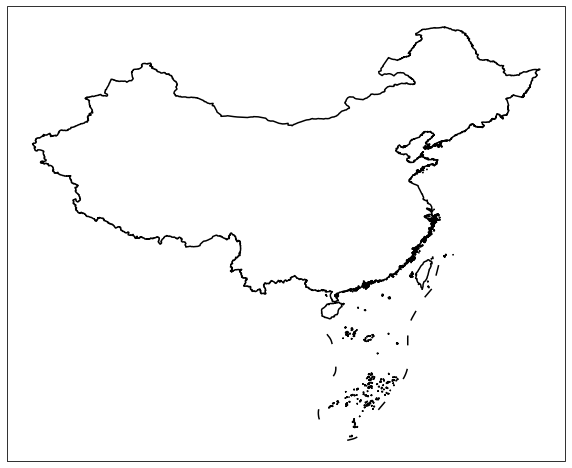

我们再来绘制一张各省的行政边界地图。

.. code:: python

    import cartopy.crs as ccrs
    import matplotlib.pyplot as plt
    from cnmaps import get_adm_maps, draw_maps

    fig = plt.figure(figsize=(10,10))
    ax = fig.add_subplot(111, projection=ccrs.PlateCarree())

    draw_maps(get_adm_maps(level='省'), linewidth=0.8, color='r') 

    plt.show()

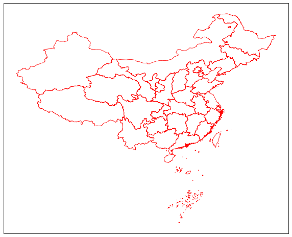

然后是市级行政区。

.. code:: python

    import cartopy.crs as ccrs
    import matplotlib.pyplot as plt
    from cnmaps import get_adm_maps, draw_maps

    fig = plt.figure(figsize=(15,15))
    ax = fig.add_subplot(111, projection=ccrs.PlateCarree())

    draw_maps(get_adm_maps(level='市'), linewidth=0.5, color='g') 

    plt.show()

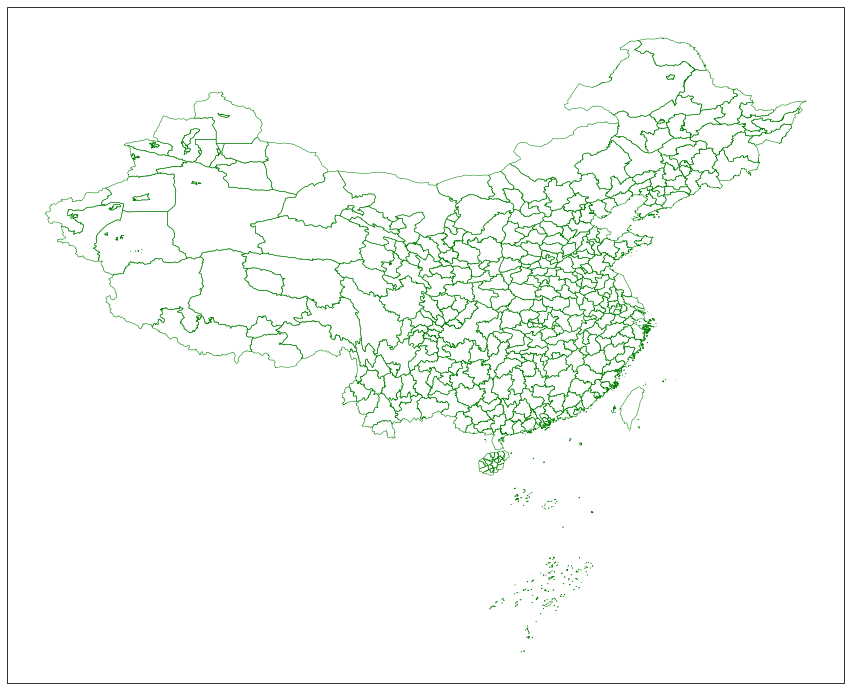

最后是区县。

.. code:: python

    import cartopy.crs as ccrs
    import matplotlib.pyplot as plt
    from cnmaps import get_adm_maps, draw_maps

    fig = plt.figure(figsize=(20,20))
    ax = fig.add_subplot(111, projection=ccrs.PlateCarree())

    draw_maps(get_adm_maps(level='区县'), linewidth=0.3, color='b') 

    plt.show()

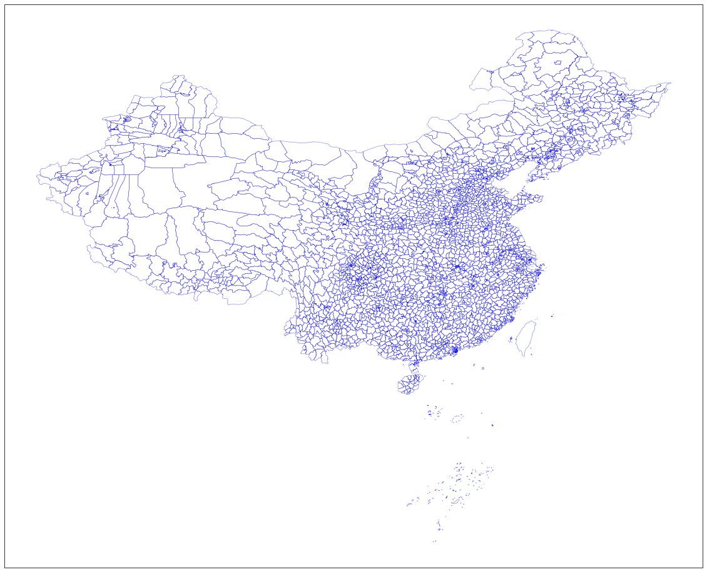

中国与周边国家国界
^^^^^^^^^^^^^^^^^^
``cnmaps-data`` 中的国外国家级边界统一存放在 ``level='国'`` 记录里。若只想查看中国周边，可直接取全部国家级记录后与中国国界同图绘制；在中国周边视角下，远处国家不会出现在当前范围内，无需额外区分“邻国”与“非邻国”。

.. literalinclude:: ../_examples/china_and_neighbors_borders.py
   :language: python

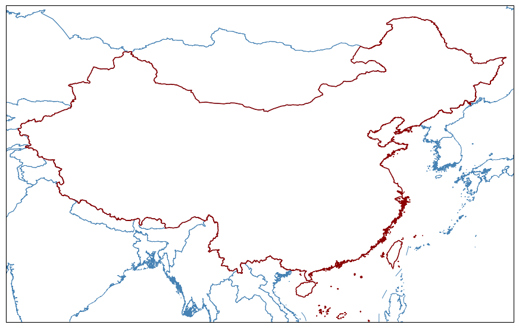

全球国家边界
^^^^^^^^^^^^
绘制全球国家边界时，也可以直接使用 ``level='国'`` 一次取回全部国家级记录；若只需中国国界，再显式传入 ``country='中国'`` 即可。

如果希望先查看最常见、最直观的全球边界展示，可以先从常规平面投影开始。下面这个例子使用 ``PlateCarree`` 投影绘制全球国家边界，并用更醒目的颜色叠加中国国界：

.. literalinclude:: ../_examples/world_countries_borders_flat.py
   :language: python

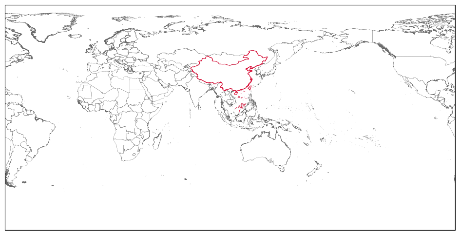

使用行政区中心点辅助制图
^^^^^^^^^^^^^^^^^^^^^^^^
前面的 ``longitude`` / ``latitude`` 字段除了可以直接查询，也很适合在地图上做标注或打点。这里集中展示几种常见的制图用法。

下面这个例子把北京、上海、舟山和三沙放在一张 2x2 图里，红点就是查询结果里的 ``longitude`` / ``latitude``：

.. literalinclude:: ../_examples/city_centroids_overview.py
   :language: python

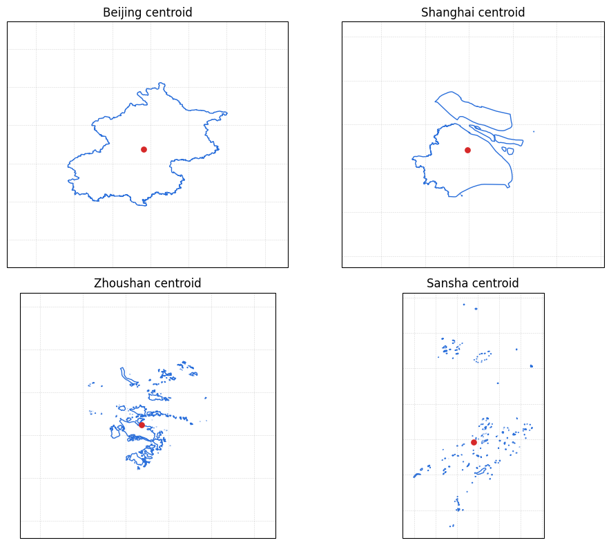

同样的写法也适用于省级和国家级边界。下面两段示例分别展示省级和国家级的质心点：

.. literalinclude:: ../_examples/province_centroids_overview.py
   :language: python

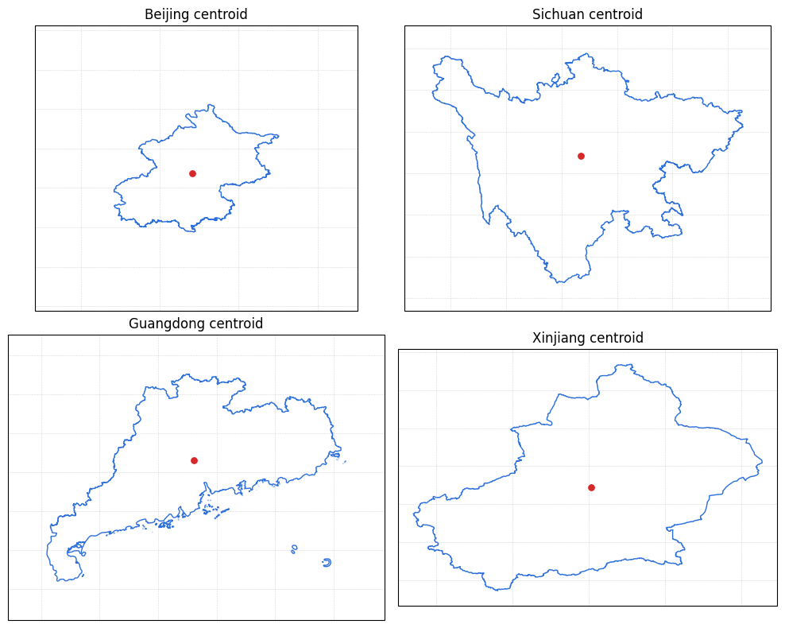

.. literalinclude:: ../_examples/country_centroids_overview.py
   :language: python

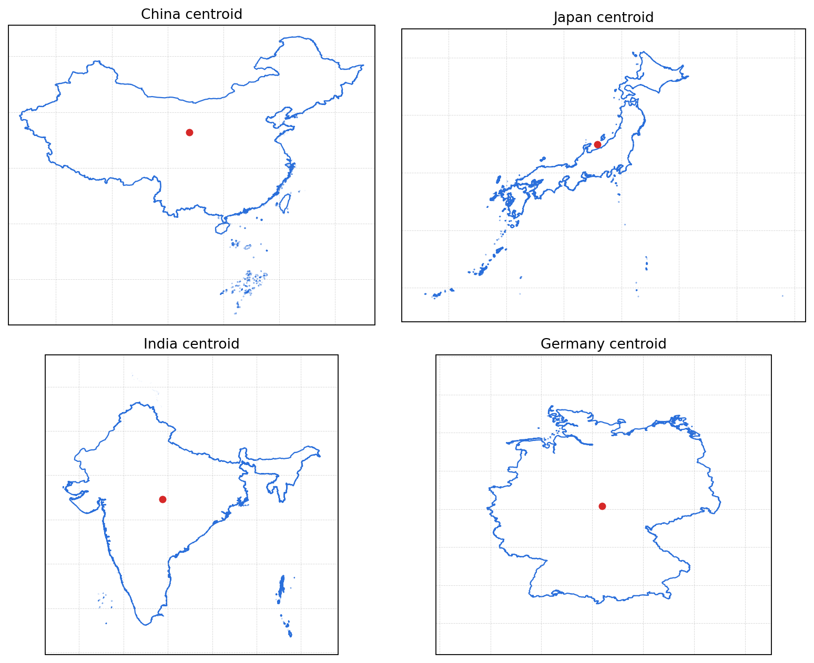

若你想进一步把质心坐标用于标注，也可以先绘制中国省级边界，再按各省会 / 首府的质心位置打点并标注英文名称。下面这个例子里，北京使用五角星强调，其他省会用圆点表示：

.. literalinclude:: ../_examples/province_capitals_labels.py
   :language: python

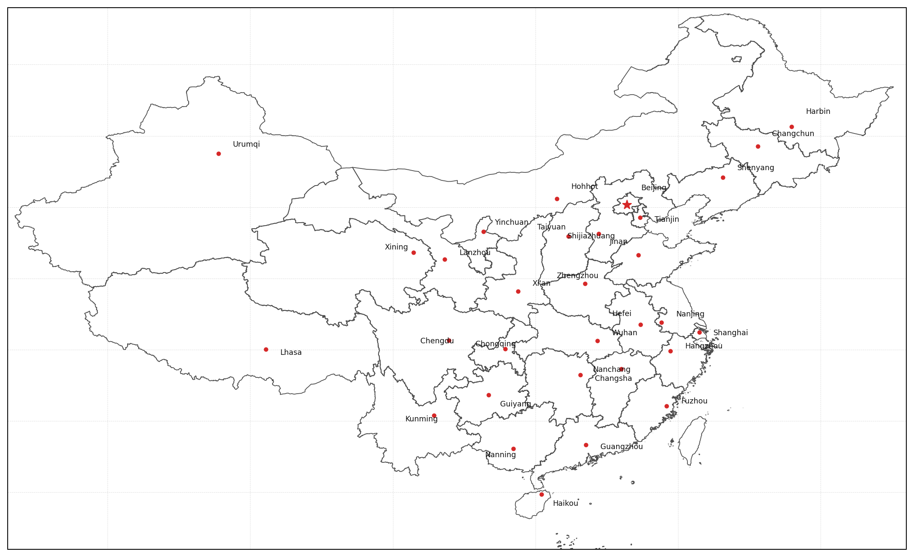

合并边界
----------
cnmaps可以很方便地对地图进行合并，例如我们可以将北京、天津、河北的边界对象直接相加获得京津冀的边界对象并绘图。

.. code:: python

    import cartopy.crs as ccrs
    import matplotlib.pyplot as plt
    from cnmaps import get_adm_maps, draw_map

    beijing = get_adm_maps(province='北京市', only_polygon=True, record='first')
    tianjin = get_adm_maps(province='天津市', only_polygon=True, record='first')
    hebei = get_adm_maps(province='河北省', only_polygon=True, record='first')

    jingjinji = beijing + tianjin + hebei

    fig = plt.figure(figsize=(5,5))
    ax = fig.add_subplot(111, projection=ccrs.PlateCarree())
    draw_map(jingjinji)

    plt.show()

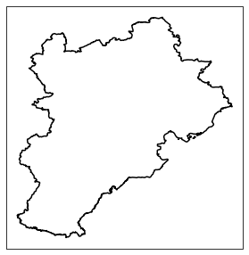

剪切地图
-----------

剪切填色等值线(contourf)图

.. code:: python

    import numpy as np
    import matplotlib.pyplot as plt
    import cartopy.crs as ccrs
    from cnmaps import get_adm_maps, clip_contours_by_map, draw_map
    from cnmaps.sample import load_dem

    lons, lats, data = load_dem()

    fig = plt.figure(figsize=(10, 10))
    ax = fig.add_subplot(111, projection=ccrs.PlateCarree())
    map_polygon = get_adm_maps(country='中国', record='first', only_polygon=True)

    cs = ax.contourf(lons, lats, data,
                    cmap=plt.cm.terrain,
                    levels=np.linspace(-2800, data.max(), 10),
                    transform=ccrs.PlateCarree())

    clip_contours_by_map(cs, map_polygon)
    draw_map(map_polygon, color='k', linewidth=1)

``clip_contours_by_map``、``clip_pcolormesh_by_map``、``clip_quiver_by_map``、``clip_scatter_by_map`` 除了支持单个 ``MapPolygon``，也支持直接传入 ``MapPolygon`` 列表或 ``GeoDataFrame``，适合一次性裁剪多个行政区组合结果。

若你只想裁剪到某个经纬度窗口内，不必再手工构造矩形 ``MapPolygon`` 并与行政边界求交；可以直接传 ``extent=[left, right, lower, upper]``，并在需要时加上 ``set_extent=True`` 一步完成裁剪和坐标范围收紧。

    plt.show()

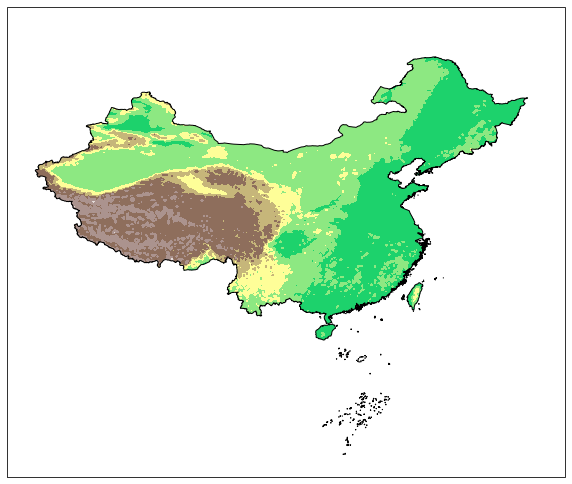

在多子图场景下，``clip_contours_by_map`` 也会自动识别 ``contour`` / ``contourf`` 对象所属的 ``Axes``，因此通常不必再手动传 ``ax=...``。下面这个例子用北京市边界分别裁剪 DEM 和气温场，并排展示两种结果：

.. code:: python

    import numpy as np
    import matplotlib.pyplot as plt
    import cartopy.crs as ccrs
    from cnmaps import get_adm_maps, clip_contours_by_map, draw_map
    from cnmaps.sample import load_dem, load_temp

    dem_lons, dem_lats, dem = load_dem()
    temp_lons, temp_lats, temp = load_temp()
    beijing = get_adm_maps(city='北京市', only_polygon=True, record='first')
    extent = beijing.get_extent(buffer=0.15)

    fig, axes = plt.subplots(
        1, 2, figsize=(10, 4.6), subplot_kw={'projection': ccrs.PlateCarree()}
    )

    panels = [
        ('Beijing DEM', dem_lons, dem_lats, dem, plt.cm.terrain, np.linspace(-200, dem.max(), 10)),
        ('Beijing Temperature', temp_lons, temp_lats, temp, plt.cm.coolwarm, np.linspace(-20, 36, 10)),
    ]

    for ax, (title, lons, lats, data, cmap, levels) in zip(axes, panels):
        cs = ax.contourf(
            lons,
            lats,
            data,
            levels=levels,
            cmap=cmap,
            transform=ccrs.PlateCarree(),
        )
        clip_contours_by_map(cs, beijing, extent=extent, set_extent=True)
        draw_map(beijing, ax=ax, color='black', linewidth=1.0)
        ax.set_title(title)

    plt.tight_layout()
    plt.show()

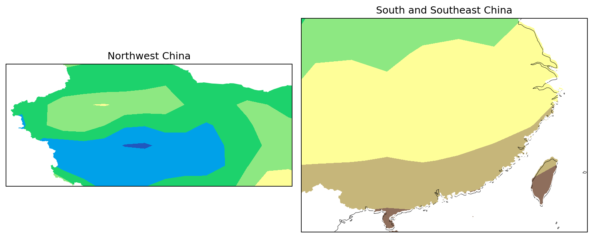

剪切填色(pcolormesh)图

.. code:: python

    import cartopy.crs as ccrs
    import matplotlib.pyplot as plt
    from cnmaps import get_adm_maps, draw_map, clip_pcolormesh_by_map
    from cnmaps.sample import load_dem

    lons, lats, dem = load_dem()
    fig = plt.figure(figsize=(10, 10))

    map_polygon = get_adm_maps(country='中国', record='first', only_polygon=True)

    ax = fig.add_subplot(111, projection=ccrs.PlateCarree())
    mesh = ax.pcolormesh(lons, lats, dem, cmap=plt.cm.terrain, vmin=-2800, transform=ccrs.PlateCarree())
    clip_pcolormesh_by_map(mesh, map_polygon)
    draw_map(map_polygon, color='k')
    ax.set_extent(map_polygon.get_extent())

    plt.show()

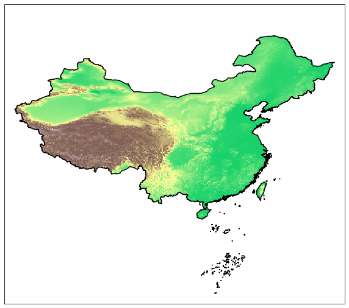

剪切箭矢簇(quiver)图

.. code:: python

    import numpy as np
    import cartopy.crs as ccrs
    import matplotlib.pyplot as plt
    from cnmaps import get_adm_maps, clip_quiver_by_map, clip_contours_by_map, draw_map
    from cnmaps.sample import load_wind

    lons, lats, u, v = load_wind()

    fig = plt.figure(figsize=(10, 10))
    ax = fig.add_subplot(111, projection=ccrs.PlateCarree())
    map_polygon = get_adm_maps(country='中国', record='first', only_polygon=True)

    spd = (u ** 2 + v ** 2) ** 0.5

    qv = ax.quiver(lons, lats, u, v,transform=ccrs.PlateCarree(), zorder=2)
    cs = ax.contourf(lons, lats, spd, cmap=plt.cm.RdYlBu_r,
                    levels=np.linspace(spd.min(), spd.max(), 50),
                    transform=ccrs.PlateCarree(), zorder=1)

    clip_contours_by_map(cs, map_polygon)
    clip_quiver_by_map(qv, map_polygon)

    draw_map(map_polygon, color='k', linewidth=1)

    plt.show()

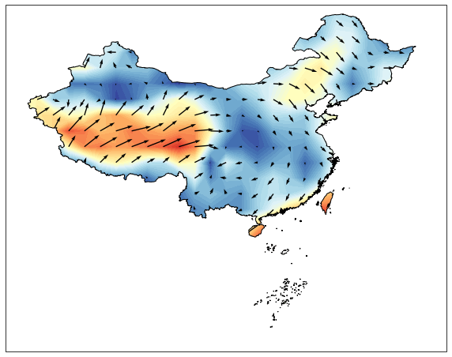

剪切流线图（streamplot）

.. code:: python

    import cartopy.crs as ccrs
    import matplotlib.pyplot as plt
    from cnmaps import get_adm_maps, clip_streamplot_by_map, draw_map
    from cnmaps.sample import load_wind

    lons, lats, u, v = load_wind()

    fig = plt.figure(figsize=(10, 10))
    ax = fig.add_subplot(111, projection=ccrs.PlateCarree())
    map_polygon = get_adm_maps(country='中国', record='first', only_polygon=True)

    stream = ax.streamplot(
        lons[0, :],
        lats[:, 0],
        u,
        v,
        transform=ccrs.PlateCarree(),
        density=2.0,
        color='#1f77b4',
    )

    clip_streamplot_by_map(stream, map_polygon)
    draw_map(map_polygon, color='k', linewidth=1)

    plt.show()

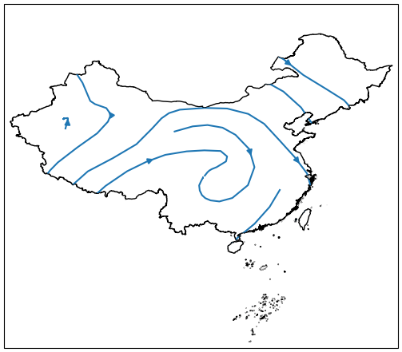

剪切散点（scatter）图

.. code:: python

    import numpy as np
    import cartopy.crs as ccrs
    import matplotlib.pyplot as plt

    from cnmaps import get_adm_maps, clip_scatter_by_map, draw_map
    from cnmaps.sample import load_wind

    lons, lats, u, v = load_wind()
    spd = (u ** 2 + v ** 2) ** 0.5

    data = list(zip(lons.flatten(), lats.flatten(), spd.flatten()))

    x = [s[0] for s in data]
    y = [s[1] for s in data]
    z = [s[2] for s in data]

    map_polygon = get_adm_maps(record='first', only_polygon=True)

    fig = plt.figure(figsize=(10, 10))
    ax = fig.add_subplot(111, projection=ccrs.PlateCarree())
    scatter = ax.scatter(x, y, s=np.array(z)*10, c=z, 
                         cmap=plt.cm.RdYlBu_r, transform=ccrs.PlateCarree())
    clip_scatter_by_map(scatter, map_polygon)
    draw_map(map_polygon, linewidth=1)
    ax.set_extent(map_polygon.get_extent(buffer=1))

    plt.show()

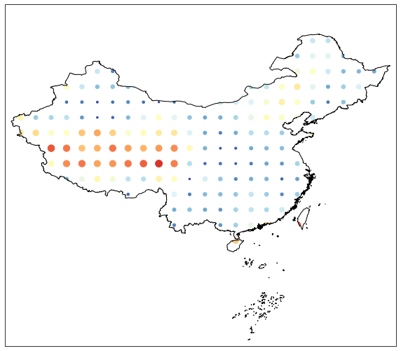

剪切等值线clabel

.. code:: python

    import numpy as np
    import matplotlib.pyplot as plt
    import cartopy.crs as ccrs
    from cnmaps import get_adm_maps, clip_clabels_by_map, clip_contours_by_map, draw_map
    from cnmaps.sample import load_dem

    lons, lats, data = load_dem()

    map_polygon = get_adm_maps(
        country='中国', record='first', only_polygon=True)
    fig = plt.figure(figsize=(10, 10))
    ax = fig.add_subplot(111, projection=ccrs.PlateCarree())
    contours = ax.contour(lons,
                            lats,
                            data,
                            cmap=plt.cm.terrain,
                            levels=np.linspace(-2500, data.max(), 20),
                            transform=ccrs.PlateCarree())
    clip_contours_by_map(contours, map_polygon)
    clabels = ax.clabel(contours,
                            levels=contours.levels,
                            colors='k',
                            fmt='%i',
                            inline=True)
    clip_clabels_by_map(clabels, map_polygon)
    draw_map(map_polygon, color='k')

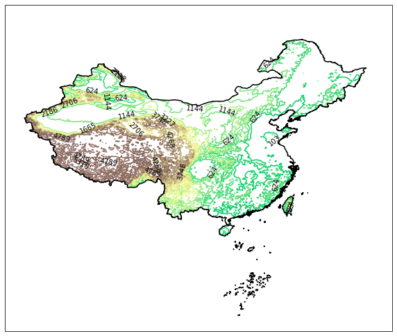

多投影支持
-----------

.. code:: python

    import cartopy.crs as ccrs
    import matplotlib.pyplot as plt
    from cnmaps import get_adm_maps, draw_map, clip_contours_by_map
    from cnmaps.sample import load_dem

    lons, lats, dem = load_dem()

    PROJECTIONS = [
        ('Mercator', ccrs.Mercator(central_longitude=100)),
        ('Mollweide', ccrs.Mollweide(central_longitude=100)),
        ('Orthographic', ccrs.Orthographic(central_longitude=100)),
        ('Robinson', ccrs.Robinson(central_longitude=100))
    ]

    fig = plt.figure(figsize=(16, 12))
    fig.tight_layout()

    china = get_adm_maps(country='中国', record='first', only_polygon=True)

    for i, prj in enumerate(PROJECTIONS):
        ax = fig.add_subplot(2,2,i+1, projection=prj[1])
        cs = ax.contourf(lons, lats, dem, cmap=plt.cm.terrain, transform=ccrs.PlateCarree())
        clip_contours_by_map(cs, china)

        draw_map(china, color='k')
        ax.set_extent(china.get_extent(buffer=3))
        ax.set_global()
        ax.coastlines()
        plt.title(prj[0])

    plt.show()

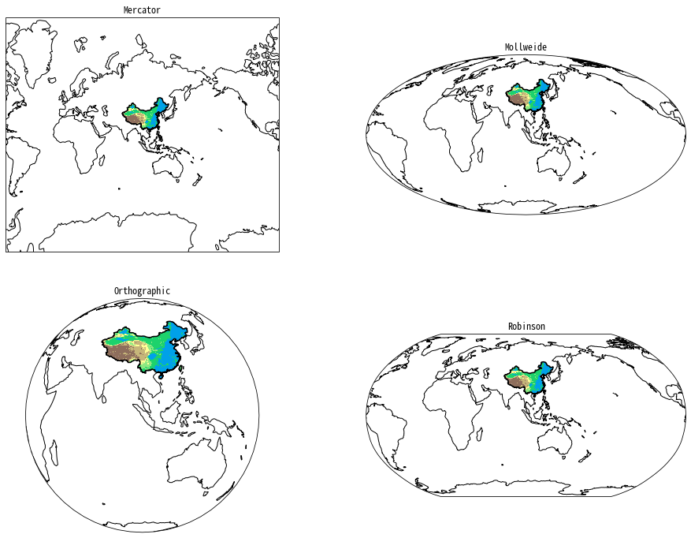

栅格遮罩
------------------
cnmaps 可以基于地图矢量数据对栅格格点数据进行遮罩（掩膜）操作，生成遮罩层对数据进行遮罩。

下面的例子可以生成中国国界的遮罩数组。

.. code:: python

    import numpy as np
    from cnmaps import get_adm_maps
    import matplotlib.pyplot as plt

    lon = np.linspace(60, 150, 1000)
    lat = np.linspace(0, 60, 1000)
    lons, lats = np.meshgrid(lon, lat)

    china = get_adm_maps(country="中国", level="国", record="first", only_polygon=True, wgs84=True)
    china_maskout_array = china.make_mask_array(lons, lats)

    plt.imshow(china_maskout_array, cmap='binary', origin='lower')
    

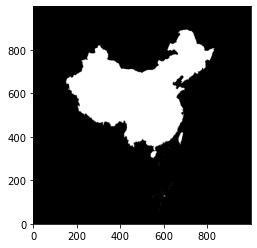

我们也可以直接对栅格数据进行遮罩。

.. code:: python

    import numpy as np
    from cnmaps import get_adm_maps
    import matplotlib.pyplot as plt

    lon = np.linspace(60, 150, 1000)
    lat = np.linspace(0, 60, 1000)

    lons, lats = np.meshgrid(lon, lat)
    data = np.random.random(lons.shape)

    china = get_adm_maps(country="中国", level="国", record= "first", only_polygon=True, wgs84=True)

    maskout_data = china.maskout(lons, lats, data)

    plt.figure(figsize=(20,8))

    plt.subplot(121)
    plt.pcolormesh(lons, lats, data)
    plt.title("no maskout")

    plt.subplot(122)
    plt.pcolormesh(lons, lats, maskout_data)
    plt.title("maskout")
    plt.show()

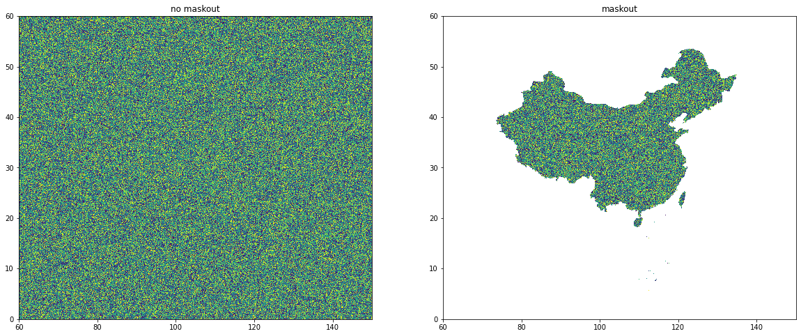

输出矢量文件
--------------
cnmaps 支持将查询到的矢量边界输出为 GeoJSON 或 ESRI Shapefile 文件。

如果你希望直接在命令行里完成“查询 + 导出”，可以使用 ``cnmaps export``。它支持与 ``get_adm_maps`` 接近的筛选参数，例如 ``country``、``province``、``city``、``district``、``level``、``source``、``provider``、``record``、``simplify`` 等；当某个筛选项需要多个值时，可以在同一个参数后依次写出多个名称。

.. code:: bash

    cnmaps export ./jingjin.geojson --province 北京市 天津市 --level 省
    cnmaps export ./east-asia.geojson --country 中国 JPN KOR --level 国
    cnmaps export ./henan.shp --province 河南省 --level 省 --record first

输出路径默认会按后缀自动推断格式：``.geojson`` / ``.json`` 对应 GeoJSON，``.shp`` 对应 ESRI Shapefile；如果你想显式指定，也可以追加 ``--engine GeoJSON`` 或 ``--engine "ESRI Shapefile"``。坐标默认输出为 WGS84，如需导出 GCJ02，可追加 ``--gcj02``。

如果你已经在 Python 代码中拿到了边界对象，也可以继续使用 ``MapPolygon.to_file(...)``：

.. code:: python

    from cnmaps import get_adm_maps

    china = get_adm_maps(country="中国", level="国", record= "first", only_polygon=True, wgs84=True)

    china.to_file('./china.geojson')  # 默认为 geojson 格式文件
    china.to_file('./china.shp', engine='ESRI Shapefile')  # 也可以指定 shapefile 格式文件

读取自定义边界文件
--------------------

除了内置行政边界以外，``cnmaps`` 也支持读取“符合 ``cnmaps boundary spec`` 的外部 GeoJSON / Shapefile 文件”，并将其转换为 ``MapPolygon``，继续用于 ``make_mask_array``、``maskout``、``clip_*`` 等工作流。

当前这套 boundary spec 的核心要求是：

- 文件格式为 ``.geojson`` / ``.json`` / ``.shp``
- CRS 必须明确且等价为 WGS84（``EPSG:4326``）
- 几何必须全部为 ``Polygon`` 或 ``MultiPolygon``
- 不能包含空几何或无效几何

如果文件包含多个 feature，``cnmaps`` 会在读取时先将它们合并为一个统一边界。

推荐先用命令行检查文件是否符合规范：

.. code:: bash

    cnmaps check-boundary ./my-boundary.geojson
    cnmaps check-boundary ./my-boundary.shp --json  # 将检查结果以 JSON 输出

检查通过后，就可以在 Python 代码中读取并继续做掩膜：

.. code:: python

    from cnmaps import read_boundary_file

    boundary = read_boundary_file("./my-boundary.geojson")
    mask = boundary.make_mask_array(lons, lats)
    masked = boundary.maskout(lons, lats, data)

如果你的原始 ``shp`` / ``geojson`` 还不符合这套规范，推荐先借助 AI 或 GIS 工具把它整理为符合 ``cnmaps boundary spec`` 的结构，再交给 ``cnmaps`` 检查和读取。

如果你希望借助 AI 来完成这一步，推荐先按 :doc:`installation` 中的说明安装 ``cnmaps`` 自带的 AI Skill，再向 AI 发送类似下面的提示词：

.. code:: text

    帮我把 <path/filename.shp> 转为符合 cnmaps 可识别格式的 shapefile/geojson 文件，并通过 cnmaps 的 check-boundary 检查。

这样 AI 会更容易按照 ``cnmaps boundary spec`` 去整理文件结构；整理完成后，再执行 ``cnmaps check-boundary ...`` 验证是否通过即可。
