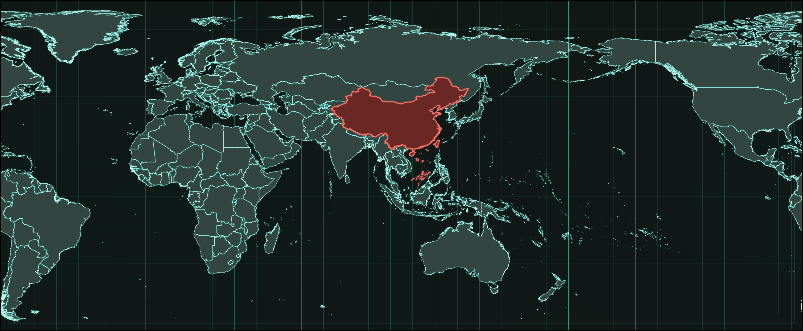

cnmaps 使用指南
==================================

cnmaps 是一个以中国领土主张为标准开发的地图类 Python 扩展包，附带科研绘图常用的图片绘制和处理功能，可用于行政边界查询、绘制与裁剪，并与 `Cartopy <https://scitools.org.uk/cartopy/>`_ 配合使用。源码与问题反馈见 `GitHub：cnmetlab/cnmaps <https://github.com/cnmetlab/cnmaps>`_ 。

当前版本具有以下几个主要功能：

1. 自带符合中国领土主张的地图边界数据，包括中国行政边界以及全球国家和地区边界，无需再单独寻找边界文件。
2. 支持地图边界之间的加、减、交、并等运算，便于组合出需要的范围。
3. 提供针对 contour、pcolormesh、quiver、scatter、clabel 等对象的按边界裁剪，以及常用栅格遮罩、白化等处理能力。
4. 与 Cartopy 集成，可在不同投影下进行科研绘图、边界叠加与结果导出。

.. raw:: html

   

.. note::

   官方边界数据由 `cnmaps-data <https://github.com/cnmetlab/cnmaps-data>`_ 提供：中国行政区边界当前基于高德整理，国外国家与地区边界当前基于世界银行数据整理；详见 :doc:`content/data-sources` 。

.. raw:: html

   

.. toctree::
   :maxdepth: 3
   :hidden:

   content/installation
   content/usage
   content/examples
   content/api-ref
   content/data-sources
   content/contributor-guide
   content/license
   content/citation
   content/changelog
